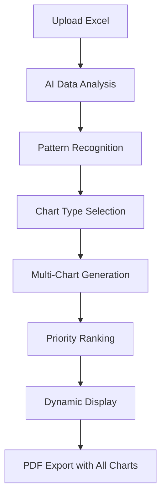

# 🎯 Dynamic AI-Powered Charts - Complete Implementation

## ✨ **Enhanced Features**

The chart system is now **fully dynamic** with AI autonomously deciding chart types and generating comprehensive visualizations for maximum analytical insight.

## 🧠 **AI-Driven Chart Intelligence**

### **Comprehensive Analysis Process**

1. **Data Pattern Recognition**
   - AI analyzes data types, relationships, and patterns
   - Identifies trends, correlations, distributions, and comparisons
   - Evaluates business value and analytical potential

2. **Dynamic Chart Selection**
   - **No 3-chart limit** - AI can recommend up to **8 charts** for deep analysis
   - **10+ chart types** supported: bar, line, pie, area, scatter, combo, histogram, heatmap, waterfall, funnel
   - **Intelligent prioritization** based on analytical value and data insights

3. **Advanced Chart Configurations**
   - **Multi-metric analysis** with combo charts
   - **Data aggregation** (sum, avg, count, max, min)
   - **Chart variants** (stacked, grouped, normalized)
   - **Secondary data series** for complex relationships

## 📊 **Supported Chart Types**

### **Core Chart Types**
- **📊 Bar Charts**: Categorical comparisons, rankings
- **📈 Line Charts**: Time series, trends, continuous data  
- **🥧 Pie Charts**: Proportions, parts of whole
- **📉 Area Charts**: Cumulative data, stacked proportions
- **🔸 Scatter Plots**: Correlations between variables

### **Advanced Chart Types**
- **🔄 Combo Charts**: Multiple data series with different scales
- **📊 Histograms**: Distribution analysis, frequency patterns
- **🔥 Heatmaps**: Correlation matrices, intensity data
- **💧 Waterfall Charts**: Sequential changes, cumulative effects
- **🔻 Funnel Charts**: Process stages, conversion analysis

## 🤖 **AI Decision Logic**

### **Chart Recommendation Criteria**

```typescript
{
  \"shouldCreateCharts\": boolean,
  \"reasoning\": \"AI explanation for chart decisions\",
  \"dataInsights\": \"Key patterns identified\",
  \"recommendedCharts\": [
    {
      \"type\": \"chart_type\",
      \"title\": \"Descriptive title\",
      \"description\": \"Analytical insights revealed\",
      \"analyticalValue\": \"High|Medium|Low\",
      \"priority\": 1-10,
      \"chartVariant\": \"stacked|grouped|normalized\"
    }
  ],
  \"suggestedCombinations\": [
    {
      \"charts\": [\"complementary chart indices\"],
      \"reasoning\": \"Why these charts work together\"
    }
  ]
}
```

### **Smart Prioritization**

1. **Priority Score**: 1-10 (1 = highest priority)
2. **Analytical Value**: High > Medium > Low
3. **Data Suitability**: Charts that best fit data characteristics
4. **Business Impact**: Visualizations that drive decisions

## 🔄 **Dynamic Workflow**

### **Enhanced Process**



### **User Experience**

1. **Upload Excel File** - Standard drag-and-drop
2. **Click \"AI Analysis & Charts\"** - Enhanced AI processing
3. **Dynamic Chart Generation** - 4-8 charts based on data complexity
4. **Comprehensive Insights** - Multiple analytical perspectives
5. **Enhanced PDF Export** - All charts included automatically

## 📈 **Chart Configurations**

### **Dynamic Data Processing**

- **Automatic Data Aggregation**: Groups and summarizes data intelligently
- **Multi-Column Analysis**: Relationships between multiple variables
- **Smart Column Mapping**: AI maps columns to appropriate chart axes
- **Data Quality Assessment**: Validates data suitability for visualization

### **Advanced Features**

- **Combo Charts**: Primary + secondary data series
- **Stacked Views**: Grouped categorical data
- **Correlation Analysis**: Heatmap relationships
- **Distribution Analysis**: Histogram frequency patterns
- **Sequential Analysis**: Waterfall progressive changes

## 🎨 **Visual Enhancements**

### **Smart Color Management**
- **15+ Safe Colors**: Browser-compatible hex/HSL colors
- **Dynamic Color Assignment**: Unique colors per chart
- **Accessibility**: High contrast for readability
- **PDF Compatibility**: Colors that render properly in PDFs

### **Enhanced UI Feedback**

```typescript
// Dynamic status display
\"Chart Status: X chart(s) generated • Y chart reference(s) ready for PDF export\"

// Analytical value indicators
\"HIGH Value\", \"MEDIUM Value\", \"LOW Value\" badges

// Chart type variety
\"BAR\", \"LINE\", \"COMBO\", \"HISTOGRAM\" type indicators
```

## 📋 **AI Analysis Display**

### **Enhanced Information**

- **Data Insights**: AI-identified patterns and relationships
- **Chart Reasoning**: Why each chart type was selected
- **Analytical Value**: Impact assessment for each visualization
- **Chart Combinations**: Recommended chart pairings
- **Comprehensive Count**: Number of charts generated

### **Progressive Disclosure**

- **Summary View**: Quick overview of chart decisions
- **Detailed Analysis**: Expandable comprehensive insights
- **Chart Combinations**: Collapsible advanced recommendations
- **Technical Details**: Chart type and priority information

## 🧪 **Testing Dynamic Features**

### **Quick Test**
1. Upload Excel with varied data types
2. Click **\"Test Dynamic Charts\"**
3. See 6 different chart types generated
4. Observe variety: bar, line, area, pie, combo, histogram

### **Real AI Test**
1. Upload business data with numeric + categorical columns
2. Click **\"AI Analysis & Charts\"**
3. AI analyzes and recommends 4-8 relevant charts
4. Each chart provides unique analytical perspective

## 🔍 **Chart Quality Assurance**

### **Data Validation**
- **Minimum Data Points**: Ensures meaningful visualizations
- **Data Type Compatibility**: Matches chart types to data characteristics
- **Missing Value Handling**: Graceful handling of incomplete data
- **Outlier Detection**: Identifies and manages extreme values

### **Rendering Reliability**
- **Safe Color Formats**: Prevents parsing errors
- **Canvas Compatibility**: Reliable chart-to-PDF conversion
- **Responsive Design**: Charts work across device sizes
- **Error Fallbacks**: Graceful degradation when chart generation fails

## 📊 **Business Value**

### **Analytical Depth**
- **Multiple Perspectives**: Same data viewed through different lenses
- **Pattern Discovery**: AI finds relationships humans might miss
- **Comprehensive Insights**: 4-8 charts provide complete picture
- **Decision Support**: Visualizations that drive business decisions

### **Efficiency Gains**
- **Automated Chart Selection**: No manual chart type decisions
- **Intelligent Prioritization**: Most valuable charts generated first
- **One-Click Generation**: Complex analysis with simple interaction
- **PDF Ready**: All charts automatically included in reports

## 🚀 **Key Improvements**

### **From Fixed to Dynamic**

| **Before** | **After** |
|------------|----------|
| 3 chart limit | Up to 8 charts |
| 5 chart types | 10+ chart types |
| Fixed selection | AI-driven choice |
| Basic configuration | Advanced options |
| Simple analysis | Comprehensive insights |

### **Enhanced Capabilities**

- ✅ **Dynamic Chart Count**: 4-8 charts based on data complexity
- ✅ **Advanced Chart Types**: Histogram, heatmap, waterfall, funnel
- ✅ **Multi-Metric Analysis**: Combo charts with dual axes
- ✅ **Smart Aggregation**: Automatic data grouping and summarization
- ✅ **Correlation Analysis**: Relationship discovery between variables
- ✅ **Priority Ranking**: Charts ordered by analytical value
- ✅ **Comprehensive PDF**: All charts included in export

---

**🎯 The chart system is now truly dynamic - AI autonomously creates comprehensive visualizations that provide maximum analytical insight from your Excel data!**"